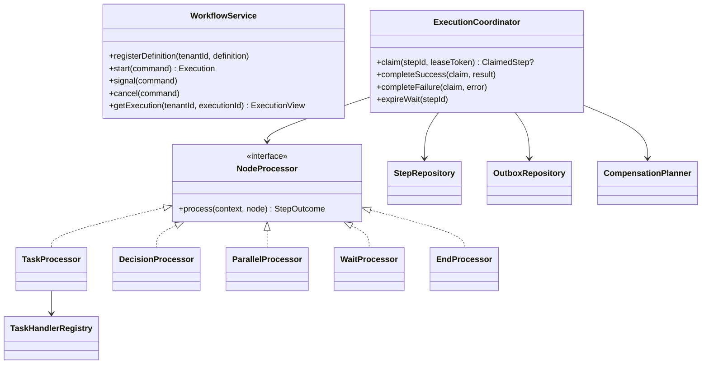

# LLD Interview Practice: Durable Workflow Orchestration Engine

## Original prompt

> i want to practise LLD for interview, i am a Backend engineer with 5 years of experience. For a start, give me the most difficult question to solve right now—one that tests me thoroughly and helps me understand concepts that apply elsewhere, covering both breadth and depth.

---

# Part 1 — The question

## Design a durable, multi-tenant workflow orchestration engine

Design the **low-level design** for a service similar to a small, developer-facing version of Temporal/AWS Step Functions. A customer defines a workflow as a directed graph of steps and starts executions. The engine must durably run each execution even when workers or processes crash.

An execution supports the following node types:

- **Task** — invokes a registered handler (for example, `chargeCard`, `sendEmail`, or `reserveInventory`).
- **Decision** — evaluates a condition against execution data and selects one outgoing transition.
- **Parallel** — starts multiple branches concurrently and joins only after all branches complete.
- **Wait** — pauses until a named external signal arrives or a timeout expires.
- **End** — completes the workflow successfully.

Each task has a retry policy: maximum attempts, exponential backoff, and a retryable-error predicate. A workflow may define compensating tasks; after a terminal failure, already-completed compensable tasks must run in reverse completion order. Workflows are versioned, tenant isolated, and observable.

### Required API

```text
registerDefinition(tenantId, definition) -> WorkflowDefinition
start(tenantId, workflowName, version, input, idempotencyKey) -> Execution
signal(tenantId, executionId, signalName, payload, idempotencyKey) -> void
getExecution(tenantId, executionId) -> ExecutionView
cancel(tenantId, executionId, reason) -> void
```

### Requirements and constraints

1. **Durability:** no workflow state is lost after a service crash. Restarting the engine must resume due work without re-running a successfully committed transition.
2. **At-least-once task delivery:** a task handler can receive the same task more than once. The design must make duplicate effects manageable.
3. **Exactly-once logical transitions:** a scheduled step must become `SUCCEEDED`, `FAILED`, or `WAITING` once, even with duplicate queue messages and racing workers.
4. **Parallelism:** branches of the same execution may run concurrently. A join is released exactly once when every required branch succeeds.
5. **Retries and time:** retries must not block worker threads. A timeout racing with a signal must pick one winner deterministically.
6. **Compensation:** cancellation or terminal failure triggers compensations in reverse completion order. Compensation must itself be idempotent and retryable.
7. **Isolation:** a tenant must never read or mutate another tenant’s definitions or executions.
8. **Extensibility:** adding a new node type should not require a large `switch` statement spread across the engine.

### What the interviewer expects

Before reading the reference answer, spend 45–60 minutes producing:

1. core entities, invariants, and state transitions;
2. interfaces and a class diagram;
3. the transactional boundary between the database, outbox, and message queue;
4. pseudocode for claiming and completing work;
5. the race handling for retry, duplicate delivery, parallel joins, and signal-vs-timeout; and
6. at least five tests that prove the hard invariants.

---

# Part 2 — Reference answer

## 1. Scope and important choices

This is an orchestration engine, not a business-rule engine. Definitions are immutable after publication; a new edit creates a new version. An execution pins the definition version it started with. PostgreSQL (or another relational database with transactions and unique constraints) is the source of truth. A queue is only a wake-up mechanism, so losing or duplicating a queue message cannot corrupt correctness.

The engine promises **exactly-once state transitions**, not exactly-once external side effects. A payment provider or email service may be called twice after a process crashes between the call and recording completion. Every task invocation therefore includes a stable `operationKey`; handlers pass it to downstream systems as their idempotency key. This is the standard practical answer to the “exactly once” interview trap.

## 2. Domain model

```text
WorkflowDefinition { tenantId, name, version, nodes: Map<NodeId, Node>, startNodeId }
Node               { id, type, next: List<NodeId>, retryPolicy?, compensation? }
TaskNode           { handlerName, inputTemplate, retryPolicy, compensation? }
DecisionNode       { expression, trueNext, falseNext }
ParallelNode       { branchStarts: List<NodeId>, joinNodeId }
WaitNode           { signalName, timeoutAtExpression, timeoutNext }
EndNode            { resultTemplate }

Execution          { id, tenantId, definitionKey, status, input, output, version, cancelRequested,
                     nextSequence, createdAt, updatedAt }
StepInstance       { id, executionId, nodeId, branchId, status, attempt, runAt, leaseUntil,
                     version, result, error, completionSequence }
Signal             { id, executionId, name, payload, idempotencyKey, status }
JoinBarrier        { executionId, joinNodeId, expectedBranches, completedBranches, released }
CompensationRecord { executionId, completedStepId, handlerName, state, completionSequence, attempt }
OutboxEvent        { id, tenantId, type, aggregateId, payload, publishedAt }
```

`branchId` identifies a path created by a parallel node. A step instance is an occurrence of a node, not the node definition itself; loops and parallel branches can therefore have separate instances of the same node.

Useful database constraints:

```text
UNIQUE (tenant_id, workflow_name, version)                 -- a published definition
UNIQUE (tenant_id, workflow_name, idempotency_key)         -- start is idempotent
UNIQUE (execution_id, node_id, branch_id, activation_no)   -- one logical activation
UNIQUE (execution_id, signal_name, idempotency_key)        -- signal is idempotent
UNIQUE (execution_id, join_node_id)                        -- one barrier
UNIQUE (execution_id, join_node_id, branch_id)             -- one branch contribution
UNIQUE (outbox_event_id)                                   -- consumer deduplication, if needed
```

Store `tenant_id` on every tenant-owned row and require it in every repository method. In production, reinforce this with database row-level security or a tenant-scoped database connection. Never accept `tenantId` from an internal queue payload without verifying it against the stored execution.

## 3. States and invariants

```text
Execution:    RUNNING | COMPENSATING | SUCCEEDED | FAILED | CANCELLED
Step:         SCHEDULED | RUNNING | WAITING | SUCCEEDED | FAILED | CANCELLED
Compensation: PENDING | RUNNING | SUCCEEDED | FAILED
Signal:       RECEIVED | CONSUMED | IGNORED
```

The central invariants are:

1. Terminal executions never return to a non-terminal state.
2. A step can be claimed only from `SCHEDULED`; it can complete only from `RUNNING` with the claimant’s lease token/version.
3. A completion transaction records the result and creates successor work (or a retry/compensation) atomically.
4. A successor activation is unique, so duplicate completion attempts cannot fan out duplicate work.
5. A join releases only when `completedBranches == expectedBranches` and `released` changes from false to true.
6. A wait has one atomic winner: signal consumption or timeout completion. The loser observes that the step is no longer `WAITING`.
7. A compensation record is created only after its forward task commits `SUCCEEDED`, and compensation ordering is descending `completionSequence`.

## 4. Object design



A `NodeProcessor` registry maps `NodeType` to a processor. The coordinator owns persistence and state transitions; processors decide the business-neutral outcome of a node. This separates the Open/Closed extension point from correctness-critical transaction code.

```java
interface NodeProcessor<N extends Node> {
    StepOutcome process(ProcessingContext context, N node);
}

sealed interface StepOutcome permits Continue, WaitForSignal, CompleteExecution, FailExecution { }
record Continue(List<Activation> next) implements StepOutcome { }
record WaitForSignal(String name, Instant timeoutAt, NodeId timeoutNext) implements StepOutcome { }
record CompleteExecution(JsonNode output) implements StepOutcome { }
record FailExecution(WorkflowError error) implements StepOutcome { }

interface TaskHandler {
    TaskResult execute(TaskContext context) throws RetryableTaskException, FatalTaskException;
}
```

`TaskContext` contains `tenantId`, `executionId`, `stepId`, input, attempt, cancellation information, and `operationKey = executionId + ":" + stepId`. It must not expose a mutable `Execution` aggregate that handlers could alter.

## 5. Starting an execution

`start` validates the definition and performs one short transaction:

```text
BEGIN
  definition = loadPublishedDefinition(tenantId, name, version)
  insert execution(tenantId, definitionKey, RUNNING, input, idempotencyKey)
       on conflict (tenantId, name, idempotencyKey) return existing execution
  insert step_instance(executionId, startNodeId, rootBranch, SCHEDULED, runAt=now)
  insert outbox_event(type=STEP_READY, aggregateId=stepId)
COMMIT
```

The idempotency conflict returns the existing execution rather than creating a second one. The outbox relay publishes committed, unpublished events to the broker. It may publish an event twice; consumers are intentionally idempotent. A periodic sweeper also scans for `SCHEDULED` steps whose `runAt <= now`, so a broker outage only adds latency.

## 6. Claiming work safely

Workers never trust an incoming message as proof that work is runnable. They claim from the database with a lease.

```sql
UPDATE step_instance
SET status = 'RUNNING',
    lease_token = :token,
    lease_until = now() + interval '30 seconds',
    attempt = attempt + 1,
    version = version + 1
WHERE id = :stepId
  AND status = 'SCHEDULED'
  AND run_at <= now()
  AND EXISTS (
      SELECT 1 FROM execution e
      WHERE e.id = step_instance.execution_id
        AND e.tenant_id = :tenantId
        AND e.status = 'RUNNING'
  )
RETURNING *;
```

Zero returned rows means another worker won, the work is delayed, or the execution is no longer runnable. A lease reaper changes expired `RUNNING` steps back to `SCHEDULED` and writes a new outbox event. Long-running handlers heartbeat to extend their lease. The lease avoids a permanently stuck step; the `operationKey` makes a reclaimed task safe.

## 7. Completing a task and scheduling successors

A task call is made outside the database transaction so locks are not held during I/O. On success, use a compare-and-set transaction:

```text
BEGIN
  step = SELECT ... FOR UPDATE WHERE id=:stepId
  require step.status == RUNNING and step.leaseToken == token
  require execution.status == RUNNING

  update step set status=SUCCEEDED, result=:result,
                  completionSequence=execution.nextSequence,
                  leaseToken=null
  update execution set nextSequence=nextSequence + 1

  if node has compensation:
      insert compensation_record(..., state=PENDING, completionSequence=oldNextSequence)

  derive successor activations from the node processor
  insert each step instance with ON CONFLICT DO NOTHING
  insert one STEP_READY outbox event for each newly inserted scheduled step
COMMIT
```

If the process crashes before this transaction, the lease eventually expires and the handler may be invoked again. If it crashes after commit but before publishing, the outbox relay publishes later. If the first worker completes after its lease was reclaimed, the lease-token check rejects its stale completion.

On a retryable error with attempts remaining, the same transaction changes the step to `SCHEDULED`, clears its lease, calculates `runAt`, and creates a delayed wake-up event. Use bounded exponential backoff with jitter:

```text
baseDelay * 2^(attempt - 1), capped at maxDelay, then randomly jitter by ±20%
```

On a non-retryable error (or exhausted attempts), mark the step `FAILED` and change the execution to `COMPENSATING` if compensation records exist; otherwise terminally `FAILED`. This transition and creation of the first compensation wake-up event occur in the same transaction.

## 8. Node-specific behavior

### Decision

`DecisionProcessor` evaluates a sandboxed, deterministic expression against immutable execution input plus completed step outputs. It creates **one** successor activation. Do not execute arbitrary customer code inside the engine.

### Parallel and join

The parallel processor creates a `JoinBarrier` and one `SCHEDULED` start step per branch in one transaction. `expectedBranches` is the number of branch starts. Every branch path carries `branchId` until it reaches the join node.

When a branch reaches the join, it executes this transaction:

```text
BEGIN
  insert join_contribution(executionId, joinNodeId, branchId)
      on conflict do nothing
  barrier = SELECT ... FOR UPDATE
  increment completedBranches only if the contribution was inserted
  if completedBranches == expectedBranches and released == false:
      set released = true
      create the one successor activation after the join
COMMIT
```

This works whether branch completions happen sequentially, concurrently, or are redelivered. If a branch fails, normal failure handling starts compensation; remaining scheduled branch work is cancelled or becomes a no-op after seeing a non-`RUNNING` execution.

### Wait, signal, and timeout

The wait processor commits the step as `WAITING`, persists its signal name and timeout deadline, and writes a timeout outbox event. `signal` inserts the signal with its idempotency key and then locks the earliest matching `WAITING` step for the execution. If found, it updates that step to `SUCCEEDED`, marks the signal `CONSUMED`, and atomically creates its successors. If not found, retain the signal as `RECEIVED` for a defined TTL so a signal arriving slightly early can be consumed when the wait is installed.

The timeout worker uses the exact same conditional transition: `UPDATE ... WHERE status='WAITING' AND deadline <= now()`. Signal and timeout race safely because only one can change `WAITING`; the other sees zero rows and does nothing. Define the tie-breaker explicitly: a signal committed before the timeout transaction wins; otherwise the timeout wins. This makes behavior explainable and testable.

### Cancellation

`cancel` sets `cancelRequested=true` under an execution-row lock. It then transitions `RUNNING` to `COMPENSATING` (or directly `CANCELLED` when no completed compensable steps exist), cancels unscheduled work, and emits a compensation wake-up event. Running handlers are cooperative: they receive cancellation through `TaskContext` and may finish; their completion transaction sees the execution state and does not activate normal successors.

### Compensation

A `CompensationPlanner` selects the next `PENDING` record ordered by `completionSequence DESC`, claims it with a lease, and invokes its handler with operation key `executionId + ":comp:" + completedStepId`. On success it marks the record complete and schedules the next one. It uses the same retry and outbox mechanics as a forward task. When no records remain, transition to `CANCELLED` for cancellation or `FAILED` for a forward failure. If a compensation exhausts retries, mark the execution `FAILED` with `COMPENSATION_FAILED` and surface the manual-repair requirement; never silently claim the original effects were undone.

## 9. Failure modes: the answer interviewers look for

| Failure | Why correctness remains intact |
|---|---|
| Queue delivers a message twice | Both workers try to claim; only one `SCHEDULED -> RUNNING` update succeeds. |
| Worker crashes before handler call | Lease expires; sweeper reschedules. |
| Worker crashes after external call | Lease expires; handler is retried with the same downstream idempotency key. |
| Worker crashes after database commit | Outbox relay later publishes the committed wake-up event. |
| Old worker finishes after lease reclaim | Its lease token/version fails the completion compare-and-set. |
| Two branches finish together | Barrier row lock plus unique contribution records releases the join once. |
| Signal and timeout fire together | Conditional update from `WAITING` permits exactly one winner. |
| Start/signal client retries HTTP request | Tenant-scoped idempotency unique key returns/records one logical request. |

## 10. Test plan

1. **Duplicate message:** deliver `STEP_READY` twice concurrently; assert exactly one handler invocation is claimed and one successor row exists.
2. **Crash after external effect:** fake a task that records `operationKey`, crash before completion, expire the lease, retry, and assert the external ledger has one logical debit.
3. **Stale completion:** claim a step twice after lease expiry; assert the old token cannot complete it.
4. **Parallel race:** finish N branches concurrently; assert one join successor and `released=true` once.
5. **Signal/timeout race:** run both transactions concurrently; assert exactly one transition from `WAITING` and one successor path.
6. **Retry clock:** assert retry attempts use the configured cap/jitter range and do not occupy a worker thread while delayed.
7. **Compensation order:** complete A, B, C, fail D; assert compensations run C, B, A and each is retried idempotently.
8. **Tenant isolation:** use identical execution IDs or guesses across tenants; assert repositories and APIs return no cross-tenant data.
9. **Outbox recovery:** commit a successor but stop the publisher; restart relay and assert work becomes claimable.
10. **Terminal-state safety:** issue cancellation, late success, duplicate failure, and retry wake-up; assert a terminal execution never schedules normal successors.

## 11. How to present this in an interview

Start with the invariants and explicitly say that the relational database is the source of truth. Then draw `Execution`, `StepInstance`, `OutboxEvent`, `JoinBarrier`, and `CompensationRecord`. Walk through the success path, then deliberately ask: “What happens if the process dies after calling the payment provider?” That naturally introduces idempotency keys, leases, the transactional outbox, and compare-and-set completion. Finish by walking through the parallel join and signal-vs-timeout races.

This one problem exercises state machines, aggregate boundaries, SOLID/strategy design, repository and transactional-outbox patterns, optimistic/conditional concurrency, idempotency, scheduling, retries, distributed-system failure semantics, compensation/Saga concepts, multi-tenancy, API design, and testable invariants. Those ideas transfer directly to order processing, payment orchestration, booking systems, job schedulers, notification platforms, and distributed task runners.
